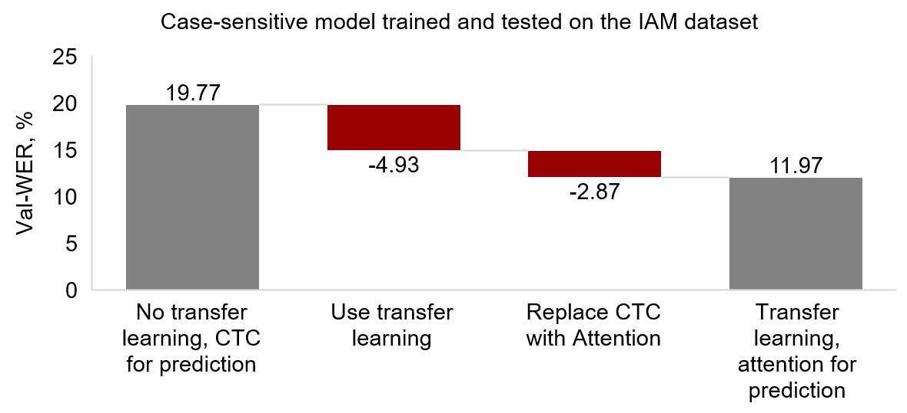

# AttentionHTR

PyTorch implementation of an end-to-end Handwritten Text Recognition (HTR) system based on attention encoder-decoder networks. [Scene Text Recognition (STR) benchmark model](https://github.com/clovaai/deep-text-recognition-benchmark) [1], trained on synthetic scene text images, is used to perform transfer learning from the STR domain to HTR. Different fine-tuning approaches are investigated using the multi-writer datasets: [Imgur5K](https://github.com/facebookresearch/IMGUR5K-Handwriting-Dataset) [2] and [IAM](https://fki.tic.heia-fr.ch/databases/iam-handwriting-database) [3]. 

For more details, refer to our paper at arXiv: https://arxiv.org/abs/2201.09390


## Dependencies

This work was tested with Python 3.6.8, PyTorch 1.9.0, CUDA 11.5 and CentOS Linux release 7.9.2009 (Core). Create a new virtual environment and install all the necessary Python packages:

```
python3 -m venv attentionhtr-env
source attentionhtr-env/bin/activate
pip install --upgrade pip
python3 -m pip install -r AttentionHTR/requirements.txt
```

## Content

* [Download our pre-trained models.](#our-pre-trained-models)
* [Run the demo for predicting words from images.](#demo)
* [Use the pre-trained models for predictions or fine-tuning on additional datasets.](#use-the-models-for-fine-tuning-or-predictions)
* [The ablation study that determines the importance of transfer learning and the attention mechanism.](#ablation-study)


## Our pre-trained models

Download our pre-trained models from [here](https://drive.google.com/drive/folders/1h6edewgRUTJPzI81Mn0eSsqItnk9RMeO?usp=sharing). The names of the .pth files are explained in the table below. There are 6 models in total, 3 for each character set, corresponding to the dataset they perform best on.


| Character set    | Imgur5K                 | IAM                 | Both datasets                 |
| :---             |     :---:               |          :---:       |          :---:             |
| Case-insensitive | AttentionHTR-Imgur5K.pth | AttentionHTR-IAM.pth | AttentionHTR-General.pth |
| Case-sensitive   | AttentionHTR-Imgur5K-sensitive.pth | AttentionHTR-IAM-sensitive.pth | AttentionHTR-General-sensitive.pth |

Print the character sets using the Python `string` module: `string.printable[:36]` for the case-insensitive and `string.printable[:-6]` for the case-sensitive character set.

Pre-trained STR benchmark models can be downloaded from [here](https://github.com/clovaai/deep-text-recognition-benchmark).

## Demo on real-world word-level images

* Download the `AttentionHTR-General-sensitive.pth` model and place it into `/model/saved_models`.
* Directory `/dataset-demo` contains ten images of text written specifically for this demo. Go to `/model` and create an LMDB dataset from them with `python3 create_lmdb_dataset.py --inputPath ../dataset-demo/ --gtFile ../dataset-demo/gt.txt --outputPath result/dataset-demo/`. Note that under Windows you may need to tune the `map_size` parameter manually for the `lmdb.open()` function.
* Obtain predictions with `python3 test.py --eval_data result/dataset-demo --Transformation TPS --FeatureExtraction ResNet --SequenceModeling BiLSTM --Prediction Attn --saved_model saved_models/AttentionHTR-General-sensitive.pth --sensitive`. The last two rows in the terminal should be 

    ````
    Accuracy: 90.00000000
    Norm ED: 0.04000000
    ````

* Inspect predictions in `/model/result/AttentionHTR-General-sensitive.pth/log_predictions_dataset-demo.txt`. Columns: batch number, ground truth string, predicted string, match (0/1), running accuracy. 

Prediction results:

| Ground truth   | This  | is    | the   | AttentionHTR | demo! |
| :---           | :---: | :---: | :---: | :---:        | :---: |
| **Author 1**   |  |  |  |  |  |
| **Prediction** | This  | is    | the   | AttentionHTR | demo! |
| **Match**      | 1     | 1     | 1     | 1            | 1     |
| **Author 2**   |  |  |  |  |  |
| **Prediction** | This  | is    | the   | AttentionHTR | demel |
| **Match**      | 1     | 1     | 1     | 1            | 0     |


## Use the models for fine-tuning or predictions

### Partitions

Prepare the train, validation (for fine-tuning) and test (for testing and for predicting on unseen data) partitions with word-level images. For the Imgur5K and the IAM datasets you may use our scripts in [`/datasets`](https://github.com/dmitrijsk/AttentionHTR/tree/main/datasets).

### LMDB datasets

When using the PyTorch implementation of the STR benchmark model [1], images need to be converted into an LMDB dataset. See [this section](https://github.com/clovaai/deep-text-recognition-benchmark#when-you-need-to-train-on-your-own-dataset-or-non-latin-language-datasets) for details. An LMDB dataset offers extremely cheap read transactions [4]. Alternatively, see [this demo](https://github.com/clovaai/deep-text-recognition-benchmark/blob/master/demo.py) that uses raw images.

### Predictions and fine-tuning 

The pre-trained models can be used for predictions or fine-tuning on additional datasets using an implementation in `/model`, which is a modified version of the [official PyTorch implementation of the STR benchmark](https://github.com/clovaai/deep-text-recognition-benchmark) [1]. Use `test.py` for predictions and `train.py` for fine-tuning. In both cases use the following arguments:

* `--Transformation TPS --FeatureExtraction ResNet --SequenceModeling BiLSTM --Prediction Attn` to define architecture.
* `--saved_model` to provide a path to a pre-trained model. In case of `train.py` it will be used as a starting point in fine-tuning and in the case of `test.py` it will be used for predictions.
* `--sensitive` for the case-sensitive character set. No such argument for the case-insensitive character set.

Specifically for fine-tuning use: 
* `--FT` to signal that model parameters must be initialized from a pre-trained model in `--saved_model` and not randomly. 
* `--train_data` and `--valid_data` to provide paths to training and validation data, respectively. 
* `--select_data "/"` and `--batch_ratio 1` to use all data. Can be used to define stratified batches.
* `--manualSeed` to assign an integer identifyer for the resulting model. The original purpose of this argument is to set a random seed.
* `--patience` to set the number of epochs to wait for the validation loss to decrease below the last minimum.

Specifically for predicting use:
* `--eval_data` to provide a path to evaluation data.

Note that `test.py` outputs its logs and a copy of the evaluated model into `/result`.

All other arguments are described inside the scripts. Original instructions for using the scripts in `/model` are available [here](https://github.com/clovaai/deep-text-recognition-benchmark).

For example, to fine-tune one of our case-sensitive models on an additional dataset:

```
CUDA_VISIBLE_DEVICES=3 python3 train.py \
--train_data my_train_data \
--valid_data my_val_data \
--select_data "/" \
--batch_ratio 1 \
--FT \
--manualSeed 1
--Transformation TPS \
--FeatureExtraction ResNet \
--SequenceModeling BiLSTM \
--Prediction Attn \
--saved_model saved_models/AttentionHTR-General-sensitive.pth \
--sensitive
```

To use the same model for predictions:

```
CUDA_VISIBLE_DEVICES=0 python3 test.py \
--eval_data my_unseen_data \
--Transformation TPS \
--FeatureExtraction ResNet \
--SequenceModeling BiLSTM \
--Prediction Attn \
--saved_model saved_models/AttentionHTR-General.pth \
--sensitive
```

## Ablation study

The table below summarizes the ablation study we performed to determine the importance of two components of the proposed framework:

1. The usage of transfer learning. "None" indicates that the model was trained with randomly initialized parameters.
2. The prediction module with two options: Connectionist Temporal Classification (CTC) and content-based attention mechanism.

A case-sensitive model is used as an example. We trained five models with different initialization random seeds for each combination and averaged their validation set CER and WER. Changes in errors against the baseline in the top row are in parentheses. The lowest errors and corresponding components are shown in **bold**.

| #                   | Transfer learning             | Prediction     | Val-CER  | Val-WER   |
| --------            | --------                      | --------       | :------: | :------:  |
| 1        | None                          | CTC            |7.12	   | 19.77     |
| 2                   | None                          | Attention      |6.79 (-0.33)	   | 18.01 (-1.77)     |
| 3                   | STR, Imgur5K     | CTC            |5.32 (-1.80)	   | 14.84 (-4.93)     |
| 4                   | **STR, Imgur5K** | **Attention**  | **4.84** (-2.28) | **11.97** (-7.81) |

The ablation study highlights that both transfer learning and the attention mechanism help reduce both CER and WER. The lowest errors are achieved when both transfer learning and attention mechanism are used. The effect of each component depends on which of them comes first. However, in both cases transfer learning is relatively more important among the two studied components as it results in a significantly larger reduction in both WER and CER. As an example, a figure below depicts the changes in WER when transfer learning and then the attention mechanism are introduced.

<div class="center">

</div>

## Acknowledgements

* Our implementation is based on [Clova AI's deep text recognition benchmark](https://github.com/clovaai/deep-text-recognition-benchmark).
* The authors would like to thank Facebook Research for [the Imgur5K dataset](https://github.com/facebookresearch/IMGUR5K-Handwriting-Dataset).
* The computations were performed through resources provided by the Swedish National Infrastructure for Computing (SNIC) at Chalmers Centre for Computational Science and Engineering (C3SE). 

## References

[1]: Baek, J. et al. (2019). What is wrong with scene text recognition model comparisons? dataset and model analysis. In *Proceedings of the IEEE/CVF International Conference on Computer Vision* (pp. 4715-4723). https://arxiv.org/abs/1904.01906

[2]: Krishnan, P. et al. (2021). TextStyleBrush: Transfer of Text Aesthetics from a Single Example. *arXiv preprint* arXiv:2106.08385. https://arxiv.org/abs/2106.08385

[3]: Marti, U. V., & Bunke, H. (2002). The IAM-database: an English sentence database for offline handwriting recognition. *International Journal on Document Analysis and Recognition*, 5(1), 39-46. https://doi.org/10.1007/s100320200071

[4]: Lightning Memory-Mapped Database. Homepage: https://www.symas.com/lmdb

## Citation

```
@article{kass2022attentionhtr,
  title={AttentionHTR: Handwritten Text Recognition Based on Attention Encoder-Decoder Networks},
  author={Kass, D. and Vats, E.},
  journal={arXiv preprint arXiv:2201.09390},
  year={2022}
}
```

## Contact

Dmitrijs Kass (dmitrijs.kass@it.uu.se)

Ekta Vats (ekta.vats@abm.uu.se)
